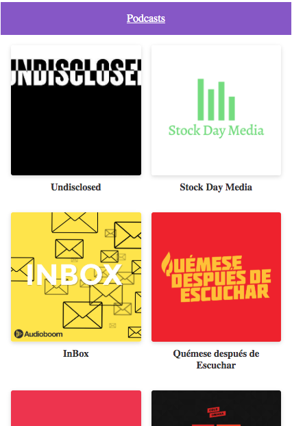

# Podcasts Platzi App

Next.JS Podcasts app using AudioBoom API

## How it works ?

Require Node JS 10

* `npm install` to install dependencies
* `npm run dev` for development
* `npm run build && npm start` for production

## License

MIT